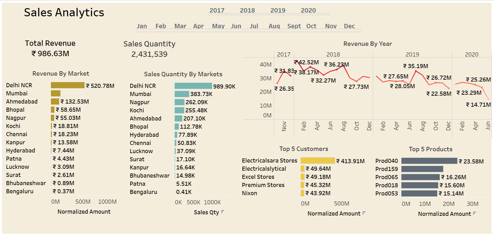
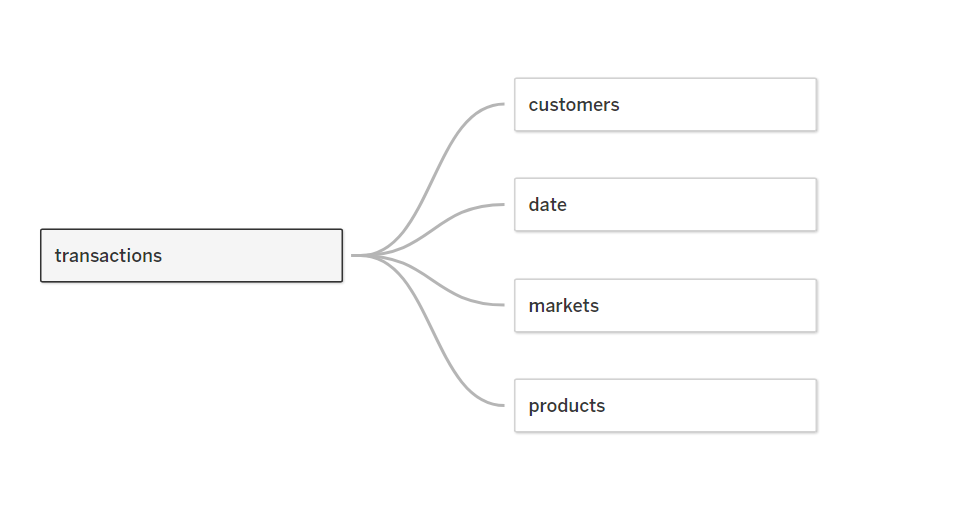

<h2 align="center">Sales Analytics with Tableau</h2>

<a href="https://public.tableau.com/views/Sales_Analytics_17016825858460/RevenueAnalysis?:language=en-US&publish=yes&:display_count=n&:origin=viz_share_link">Link to Interactive Dashboard</a>

I spearheaded a comprehensive sales analytics project utilizing Tableau to extract actionable insights from company data. The objective was to enhance strategic decision making by analyzing key metrics, including Revenue by Market, Sales Quantity by Markets, Revenue by Year, Top 5 Customers, and Top 5 Products.

1. Revenue By Market

2. Sales Quantity By Markets

3. Revenue By Year

4. Top 5 Customers

5. Top 5 Products
